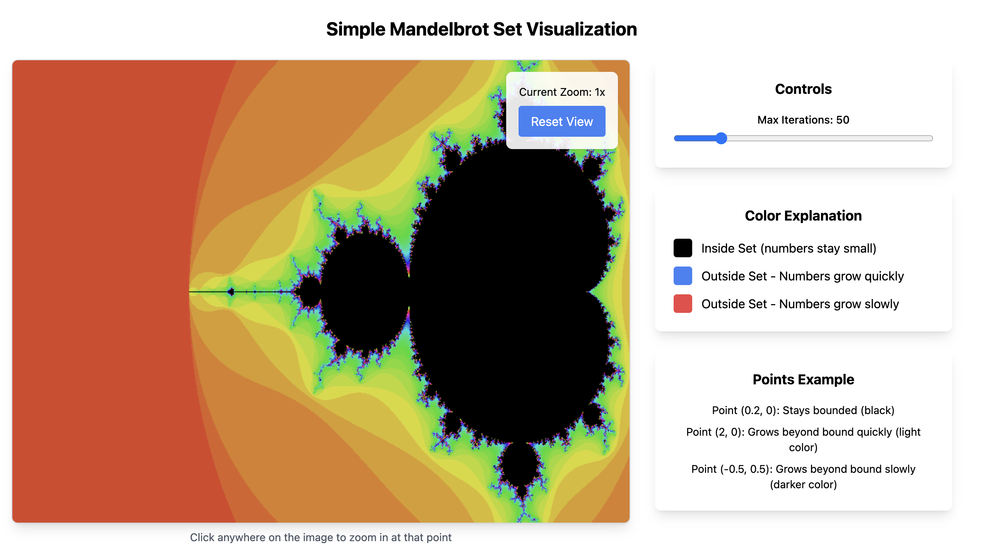

# Mandelbrot Set Visualization Playground

A simple implementation of the Mandelbrot set visualization Playground.

## Structure

- `src/components/MandelbrotSet.js` - Main visualization component
- `src/App.js` - Main application component
- `src/styles.css` - Styling for the visualization

## Generated Images

Place your generated Mandelbrot set images here:

## Running the Project

1. Clone the repository
2. Install dependencies: `npm install`
3. Run the development server: `npm start`
4. Visit `http://localhost:3000` to see the visualization

