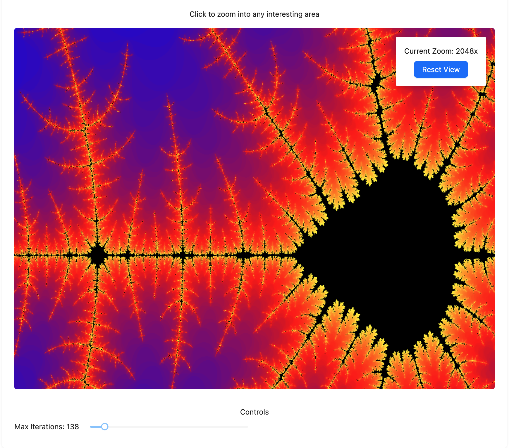

# Mandelbrot Set Visualization Playground

A simple implementation of the Mandelbrot set visualization Playground.

## Generated Images

Place your generated Mandelbrot set images here:

### Home View

### Zoomed views

| 8x Zoom | 16x Zoom |
|---------|----------|
|  |  |
| **256x Zoom** | **2048x Zoom** |
|  |  |

## Running the Project locally

1. Clone the repository
2. Install dependencies: `npm install`
3. Run the development server: `npm start`
4. Visit `http://localhost:3000` to see the visualization
